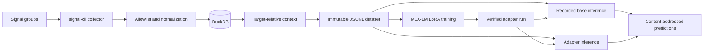

# Idiolect

```text
     ╭─╮
  ╭──╯ ╰──╮
  │  · ·  │    IDIOLECT
  ╰──╮ ╭──╯    someone, reconstructed.
     ╰─╯
```

Idiolect is a local-first ML pipeline for experiments with the writing style of a
consenting Signal user. It collects allowlisted group messages, preserves native
mention and reply context, builds immutable target-specific datasets, trains
MLX-LM LoRA adapters, and generates reproducible local predictions.



The canonical configuration keeps Signal data, datasets, model files, adapters,
and predictions under the ignored `var/` directory. The repository tracks public
settings in `conf/idiolect.toml` and complete experiment settings in `conf/exp/`.
Evaluation has a typed contract but no evaluation runner.

## Requirements

- Python 3.14
- [`uv`](https://docs.astral.sh/uv/)
- [`just`](https://just.systems/) 1.46.0 or later
- A current `signal-cli` release and a local QR code tool for collection
- An Apple silicon Mac for the MLX-LM training and inference workflow

Run commands from the repository root. Use only messages from people who consent
to the collection and model experiment.

## Set up

Install the core environment:

```console
just sync
```

Link `signal-cli` as a secondary Signal device as described in
[Signal collection](docs/signal.md). Then create the private environment file:

```console
touch .env
chmod 600 .env
```

Add the account first:

```sh
IDIOLECT_SIGNAL_ACCOUNT="+14165550123"
```

The values above are placeholders. Do not commit a real account, group ID,
message, token, or model artifact. Idiolect does not load `.env` automatically
for interactive commands. Load it in the current shell:

```console
set -a
source .env
set +a
```

List groups, then add the selected IDs to `.env`:

```console
uv run idiolect signal groups
```

```sh
IDIOLECT_SIGNAL_CHATS='["GROUP_ID_ONE=", "GROUP_ID_TWO="]'
```

Load `.env` again after you add the group IDs.

## Run the pipeline

Collect queued messages once, or use the documented macOS LaunchAgent for
continuous collection:

```console
uv run idiolect signal collect
just collect status
```

Build an immutable dataset for the linked Signal user:

```console
just data people
just data build TARGET_NAME
```

Install MLX-LM and run a short tracked experiment:

```console
just sync-train
just config train qwen3-8b-smoke var/data/DATASET_ID
```

Generate paired predictions from the exact base model and adapter recorded by
the run:

```console
just infer base-of var/runs/RUN_ID var/data/DATASET_ID test qwen3-8b-smoke
just infer run var/runs/RUN_ID var/data/DATASET_ID test qwen3-8b-smoke
```

Use `just config new NAME` to copy the complete canonical configuration before
you define another experiment. Do not change a configuration after you use it
for a recorded run.

## Documentation

The [operations index](docs/index.md) is the replication entry point. It links
the procedures for Signal setup, security, collection, `launchd`, conversation
context, dataset construction, training, inference, and development.

Important constraints:

- The collector receives new queued events. It does not import existing phone
  history.
- Stop the continuous collector during `reindex` and dataset construction.
- Collection can continue during training and inference because those operations
  use immutable files.
- Keep the Mac on, awake, and logged in for the LaunchAgent. Training and
  inference recipes use `caffeinate`.
- Treat raw events and hashed records as private data.

## Develop

Source code uses the `src` layout. Tests use synthetic fixtures, temporary
storage, and fake external boundaries.

```console
just check
uv build
```

See [Development and verification](docs/development.md) and
[AGENTS.md](AGENTS.md) for repository rules.
